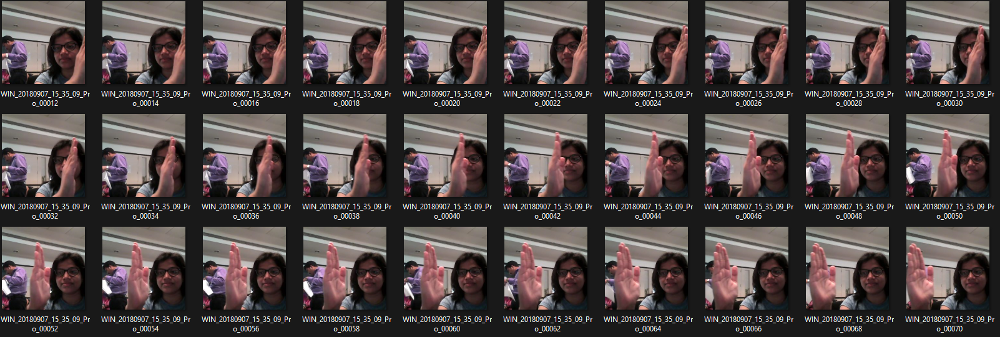
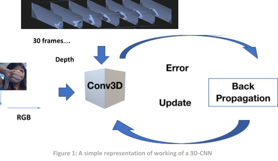
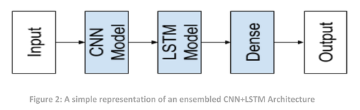

# Neural Networks Project - Gesture Recognition

## Table of Contents
* [Problem Statement](#problem-statement)
* [Understanding the Dataset](#understanding-the-dataset)
* [Objective](#objective)
* [Model Architecture](#model-architecture)
* [Data Generator](#data-generator)
* [Technologies Used](#technologies-used)
* [Acknowledgements](#acknowledgements)

## Problem Statement
Imagine you are working as a data scientist at a home electronics company which manufactures
state of the art smart televisions. You want to develop a cool feature in the smart-TV that
can recognise five different gestures performed by the user which will help users control the TV
without using a remote.
The gestures are continuously monitored by the webcam mounted on the TV. Each gesture
corresponds to a specific command:
● Thumbs up: Increase the volume
● Thumbs down: Decrease the volume
● Left swipe: 'Jump' backwards 10 seconds
● Right swipe: 'Jump' forward 10 seconds
● Stop: Pause the movie

### Understanding the Dataset

Here’s the data: https://drive.google.com/uc?id=1ehyrYBQ5rbQQe6yL4XbLWe3FMvuVUGiL

The training data consists of a few hundred videos categorised into one of the five classes. Each
video (typically 2-3 seconds long) is divided into a sequence of 30 frames(images). These videos have
been recorded by various people performing one of the five gestures in front of a webcam - similar
to what the smart TV will Use.

### Objective
Your task is to train a model on the 'train' folder which performs well on the 'val' folder as well (as
usually done in ML projects). We have withheld the test folder for evaluation purposes - your final
model's performance will be tested on the 'test' set.

## Model Architecture
For analysing videos using neural networks, two types of architectures are used commonly. One is
the standard CNN + RNN architecture in which you pass the images of a video through a CNN which
extracts a feature vector for each image, and then pass the sequence of these feature vectors
through an RNN.
The other popular architecture used to process videos is a natural extension of CNNs - a 3D
convolutional network. In this project, you will try both these architectures.
1. 3D Convolutional Neural Networks (Conv3D) :-
3D convolutions are a natural extension to the 2D convolutions you are already familiar with. Just
like in 2D conv, you move the filter in two directions (x and y), in 3D conv, you move the filter in three
directions (x, y and z). In this case, the input to a 3D conv is a video (which is a sequence of 30 RGB
images). If we assume that the shape of each image is 100x100x3, for example, the video becomes a
4-D tensor of shape 100x100x3x30 which can be written as (100x100x30)x3 where 3 is the number
of channels. Hence, deriving the analogy from 2-D convolutions where a 2-D kernel/filter (a square
filter) is represented as (fxf)xc where f is filter size and c is the number of channels, a 3-D
kernel/filter (a 'cubic' filter) is represented as (fxfxf)xc (here c = 3 since the input images have three
channels). This cubic filter will now '3D-convolve' on each of the three channels of the
(100x100x30) tensor.
 

2. CNN + RNN architecture

The conv2D network will extract a feature vector for each image, and a sequence of these feature
vectors is then fed to an RNN-based network. The output of the RNN is a regular softmax (for a
classification problem such as this one).

## Data Generator
This is one of the most important part of the code. In the generator, we are going to
pre-process the images as we have images of 2 different dimensions (360 x 360 and 120 x
160) as well as create a batch of video frames. The generator should be able to take a batch
of videos as input without any error. Steps like cropping, resizing and normalization should
be performed successfully .
Data Pre-processing
● Resizing and cropping of the images. This was mainly done to ensure that the NN
only recognizes the gestures effectively rather than focusing on the other
background noise present in the image.
● Normalization of the images. Normalizing the RGB values of an image can at times
be a simple and effective way to get rid of distortions caused by lights and shadows
in an image.

## Technologies Used
- pandas - 1.3.4
- numpy - 1.20.3
- matplotlib - 3.4.3
- seaborn - 0.11.2
- plotly - 5.8.0
- sklearn - 1.1.2
- statsmodel - 0.13.2
- tensorflow - 2.11.0
- cv2 (OpenCV) - 4.5.5
- keras - 2.6.0

## Acknowledgements
This project was an assignment provided by the Upgrad.
Reference taken for this assignment are:-
- https://www.geeksforgeeks.org/
- https://seaborn.pydata.org/
- https://plotly.com/
- https://pandas.pydata.org/
- https://learn.upgrad.com/
- https://www.tensorflow.org/

## Contact
Created by [Kuldeep Lodha](https://github.com/kuldeeplodha) - feel free to contact me!
